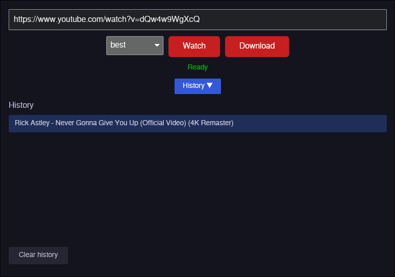

# streamlink-video-launcher

A small GUI application that launches online videos and livestreams in your default video player or downloads them to disk. Built with Rust and [Iced](https://iced.rs/).

## Features

- **Watch** — resolves a URL (Twitch, YouTube, VOD, etc.) and plays it in `mpv` / `vlc` / `celluloid`
- **Download** — saves the stream to a user-chosen location
- **Quality picker** — best, 1080p, 720p, 480p, 360p, audio-only, worst
- **History** — persists entries with title, URL, and timestamp; expand/collapse, restore URL, clear with confirmation
- **Auto-install** — on first launch, detects missing backends and offers to download/install them

## Screenshot



## Dependencies

The app itself is a standalone binary. It requires one or both backends at runtime:

| Backend | Needed for | Install method |
|---------|-----------|----------------|
| [streamlink](https://streamlink.github.io/) | Twitch, VODs, most streaming sites | `pip install --user streamlink` (or distro package) |
| [yt-dlp](https://github.com/yt-dlp/yt-dlp) | YouTube (above 360p) | Download binary to `~/.local/bin/` |

- **Player** (one of): `mpv`, `vlc`, or `celluloid`

> streamlink's YouTube plugin is capped at 360p. For higher qualities the app routes YouTube URLs through yt-dlp directly. When mpv is the default player, it handles YouTube natively via `--ytdl-format=` (no yt-dlp URL extraction needed).

## Building

```bash
git clone https://github.com/YOUR_USER/streamlink-video-launcher
cd streamlink-video-launcher
cargo build --release
```

The binary is at `target/release/streamlink-video-launcher`.

### Prerequisites

- [Rust](https://rustup.rs/) (edition 2021)
- Linux: `pkg-config`, `libxcb`, `libxkbcommon` (or the equivalent dev packages for your distro)
- macOS: Xcode command-line tools
- Windows: no extra tools needed

## Usage

1. Launch the app
2. Paste a URL (or local file path) into the input field
3. Select quality from the dropdown
4. Click **Watch** to play, or **Download** to save to disk
5. History entries can be clicked to restore a previous URL

### Local files

Paste or type a file path (e.g. `/home/user/video.mp4`) and click **Watch** — it opens the file in the system default player. Only absolute paths are validated.

## Auto-install on first run

If streamlink or yt-dlp is missing at startup, the app shows a **Setup Required** dialog:

- **yt-dlp** — downloaded from GitHub as a standalone binary to `~/.local/bin/yt-dlp` (Linux/macOS) or `%LOCALAPPDATA%\streamlink-video-launcher\bin\yt-dlp.exe` (Windows)
- **streamlink** — installed via `pip install --user streamlink`. If Python/pip is not found, the app opens your browser to the streamlink install page.

Click **Skip** to proceed anyway (URLs for missing backends will show an error).

## Platform support

| Platform | Status |
|----------|--------|
| Linux    | ✅ Primary target (tested on Fedora) |
| macOS    | ✅ Should work (untested) |
| Windows  | ✅ Cross-compiles (untested) |

## How it works

```
URL input
  ├── YouTube → yt-dlp (or mpv --ytdl-format)
  └── Other   → streamlink --player <player>

Local file path → xdg-open / open / cmd start
```

### Backend detection

- Player probe order: `mpv` → `vlc` → `celluloid`
- streamlink/yt-dlp checked via `--version` (PATH) with a fallback to the auto-install directory

## License

MIT
